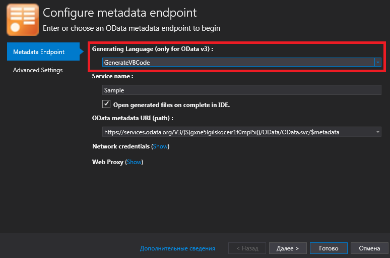
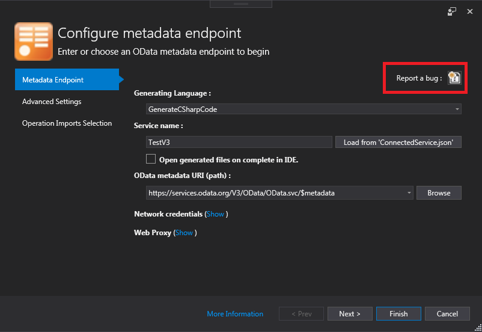

#

[Unchase OData Connected Service](https://marketplace.visualstudio.com/items?itemName=Unchase.unchaseODataConnectedService) is a Visual Studio extension to generate `C#` client code for `OData` web service.

> The project is developed and maintained by [Nikolay Chebotov (**Unchase**)](https://github.com/unchase).

## Getting Started

Install from `Tools -> Extensions and Updates` menu inside [Visual Studio](https://visualstudio.microsoft.com/vs/) (including 2019) or [download](http://vsixgallery.com/extensions/Unchase.OData.ConnectedService.afc46f39-8c64-4e14-85d0-af6c7c4291f3/extension.vsix)  as `VSIX` package from VSGallery or [download](https://marketplace.visualstudio.com/items?itemName=unchase.unchaseODataConnectedService)  as `VSIX` package from Visual Studio Marketplace: 

## Builds status

|Status|Value|
|:----|:---:|
|Build|
|Buid History|
|GitHub Release|
|GitHub Release Date|
|GitHub Release Downloads|
|VS Marketplace|
|VS Marketplace Downloads|
|VS Marketplace Installs|

## Features

- Generate `C#` clients/proxies (client code) from OData specifications for OData protocol versions 1.0-4.0
- Generate `VisualBasic` clients/proxies (client code) from OData specifications for OData protocol versions 1.0-3.0
- Generate `C#` proxy-class extension methods for OData protocol versions 1.0-3.0
- Generate functions to call service methods from OData protocol versions 1.0-3.0 `FunctionImports`
- Add required dependencies for the `C#` client (before generating):
	- Libraries for `OData v3` Client:
		1. Microsoft.Data.Services.Client ([NuGet](https://www.nuget.org/packages/Microsoft.Data.Services.Client))
		2. Microsoft.Data.OData ([NuGet](https://www.nuget.org/packages/Microsoft.Data.OData))
		3. Microsoft.Data.Edm ([NuGet](https://www.nuget.org/packages/Microsoft.Data.Edm))
		4. System.Spatial ([NuGet](https://www.nuget.org/packages/System.Spatial))
		5. *In additional*: System.ValueTuple ([NuGet](https://www.nuget.org/packages/System.ValueTuple))
	- Libraries for `OData v4` Client:
		1. Microsoft.OData.Client ([NuGet](https://www.nuget.org/packages/Microsoft.OData.Client))
		2. Microsoft.OData.Core ([NuGet](https://www.nuget.org/packages/Microsoft.OData.Core))
		3. Microsoft.OData.Edm ([NuGet](https://www.nuget.org/packages/Microsoft.OData.Edm))
		4. Microsoft.Spatial ([NuGet](https://www.nuget.org/packages/Microsoft.Spatial))
- Storage of the last 10 endpoints (json-specification path)

## `VisualBasic` is supported since v0.5.0!

## HowTos

- [ ] Add HowTos in a future
- [ ] ... [request for HowTo you need](https://github.com/unchase/Unchase.OData.Connectedservice/issues/new?title=DOC)

## Troubleshooting

### Installation completes but I can't see the Service in the list of connected services (Visual Studio 2019)

- Relevant [bug report](https://developercommunity.visualstudio.com/content/problem/468751/vs2019-preview-cannot-install-connected-service-ex.html). Connected Services will be restored in the first update to [Visual Studio](https://visualstudio.microsoft.com/vs/) 2019 (version 16.1).

## Roadmap

See the [changelog](CHANGELOG.md) for the further development plans and version history.

## Feedback

Please feel free to add your [review](https://marketplace.visualstudio.com/items?itemName=unchase.unchaseODataConnectedService&ssr=false#review-details), [request a feature](https://github.com/unchase/Unchase.OData.Connectedservice/issues/new?title=FEATURE), [ask a question](https://marketplace.visualstudio.com/items?itemName=unchase.unchaseODataConnectedService&ssr=false#qna) or [report a bug](https://github.com/unchase/Unchase.OData.Connectedservice/issues/new?title=BUG) including in connected service:

Thank you in advance!

## Thank me!

If you like what I am doing and you would like to thank me, please consider:

Thank you for your support!

----------

Copyright &copy; 2019 [Nikolay Chebotov (**Unchase**)](https://github.com/unchase) - Provided under the [Apache License 2.0](LICENSE.md).
